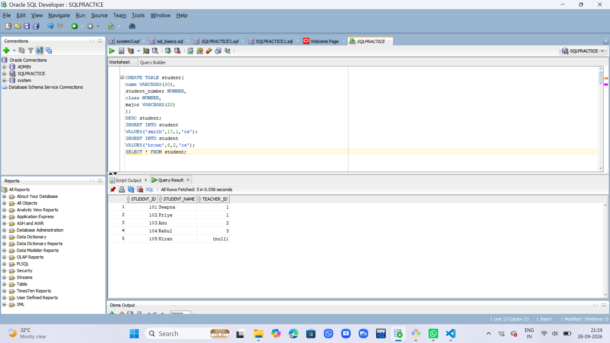
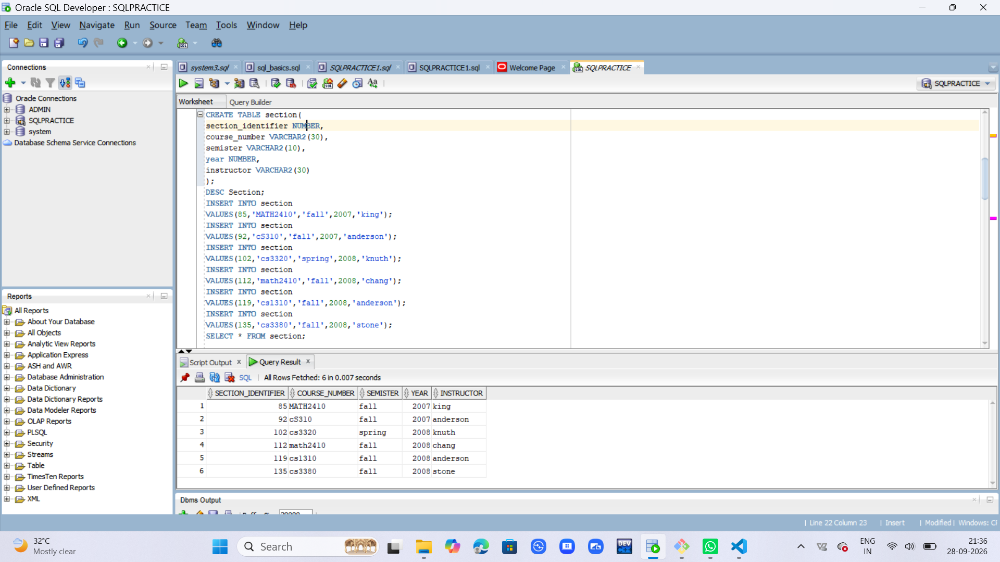
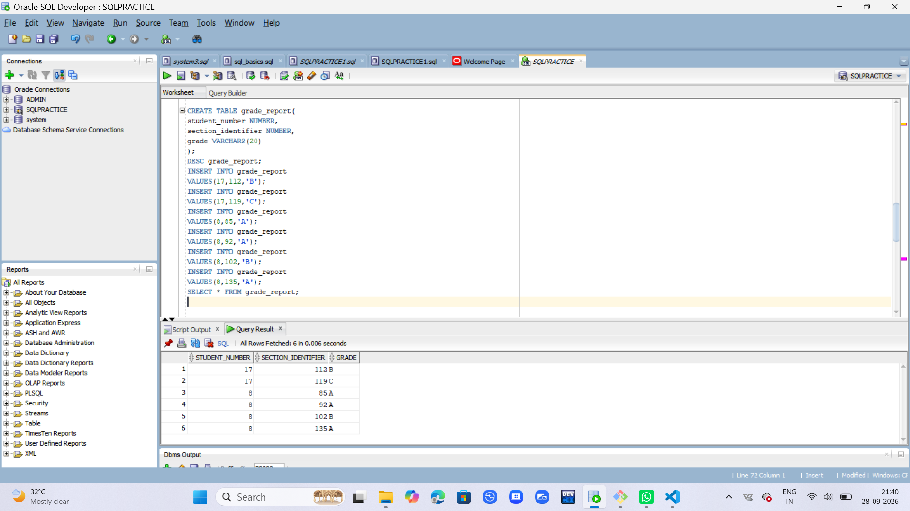
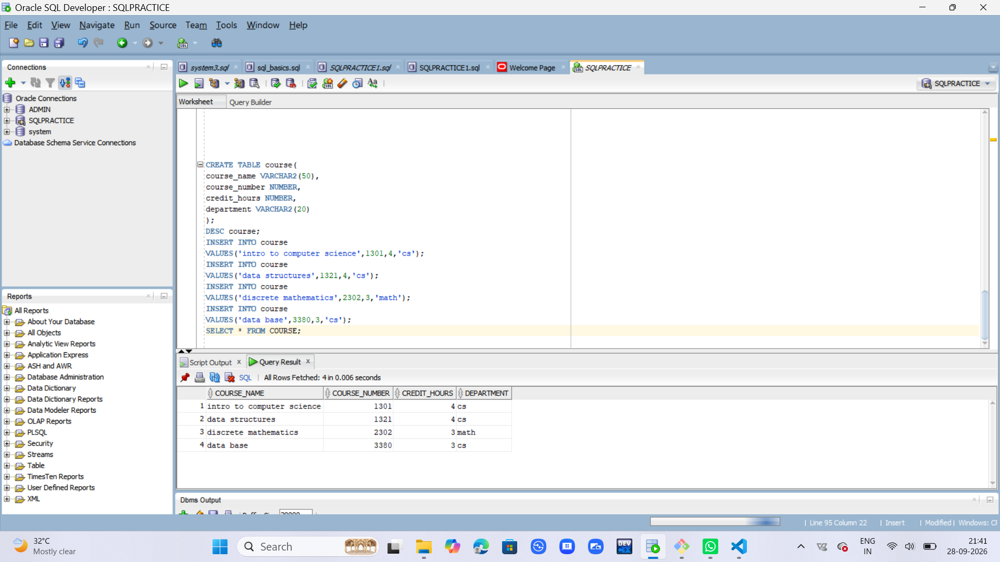

## CREATING STUDENT TABLE
```
CREATE TABLE student(
name VARCHAR2(30),
student_number NUMBER,
class NUMBER,
major VARCHAR2(20)
);
```
## DESCRIBE STUDENT TABLE
```
DESC student;
```

## INSERTING VALUES INTO STUDENT TABLE
``` 
INSERT INTO student
VALUES('smith',17,1,'cs');
INSERT INTO student
VALUES('brown',8,2,'cs');
SELECT * FROM student;
```

## DISPLAYING STUDENT TABLE
```
SELECT * FROM Student;
```

## CREATE SECTION TABLE
```
CREATE TABLE section(
section_identifier NUMBER,
course_number NUMBER,
semister VARCHAR2(10),
year NUMBER,
instructor VARCHAR2(30)
);
```
## DESCRIBE SECTION TABLE
```
DESC Section;
```
## INSERT SECTION TABLE 
```
INSERT INTO section
VALUES(85,'MATH2410','fall',2007,'king');
INSERT INTO section
VALUES(92,'cS310','fall',2007,'anderson');
INSERT INTO section
VALUES(102,'cs3320','spring',2008,'knuth');
INSERT INTO section
VALUES(112,'math2410','fall',2008,'chang');
INSERT INTO section
VALUES(119,'cs1310','fall',2008,'anderson');
INSERT INTO section
VALUES(135,'cs3380','fall',2008,'stone');
SELECT * FROM section;

```
## DISPLAY SECTION TABLE
```
SELECT * FROM section;
```

## CREATE GRADE_REPORT TABLE
```
CREATE TABLE grade_report1(
student_number NUMBER,
section_identifier NUMBER,
grade VARCHAR2(20)
);
```
## DESCRIBE GRADE_REPORT TABLE
```
DESC grade_report1;
```
## INSERT GRADE_REPORT TABLE
```
INSERT INTO grade_report1
VALUES(17,112,'B');
INSERT INTO grade_report1
VALUES(17,119,'C');
INSERT INTO grade_report1
VALUES(8,85,'A');
INSERT INTO grade_report1
VALUES(8,92,'A');
INSERT INTO grade_report1
VALUES(8,102,'B');
INSERT INTO grade_report1
VALUES(8,135,'A');

```
## DISPLAY GRADE_REPORT TABLE
```
SELECT * FROM grade_report1;
```

## CREATE COURSE TABLE
```
CREATE TABLE course(
course_name VARCHAR2(50),
course_number NUMBER,
credit_hours NUMBER,
department VARCHAR2(20)
);
```
## DESCRIBE COURSE TABLE
```
DESC course;
```
## INSERT COURSE TABLE
```
INSERT INTO course
VALUES('intro to computer science',1301,4,'cs');
INSERT INTO course
VALUES('data structures',1321,4,'cs');
INSERT INTO course
VALUES('discrete mathematics',2302,3,'math');
INSERT INTO course
VALUES('data base',3380,3,'cs');
```
## DISPLAY COURSE TABLE
```
SELECT * FROM COURSE;
```

