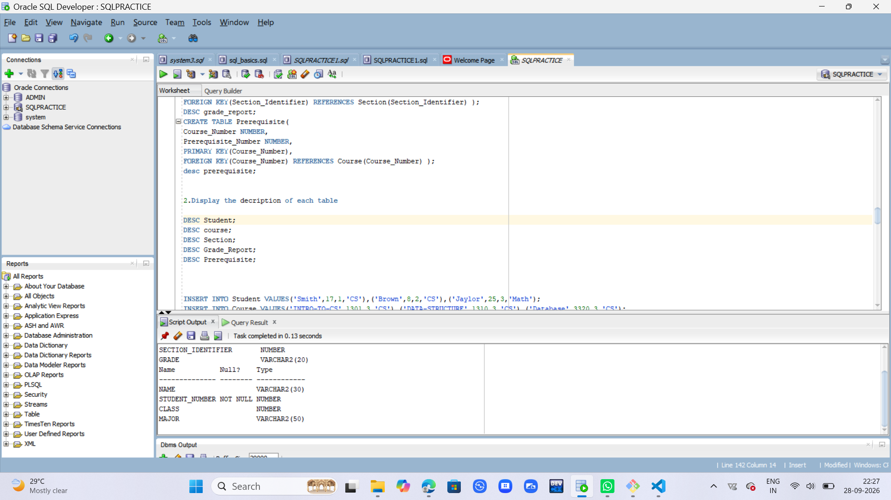
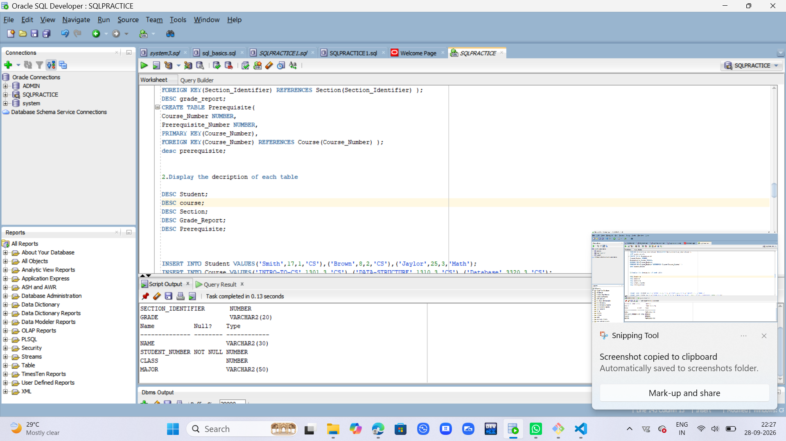
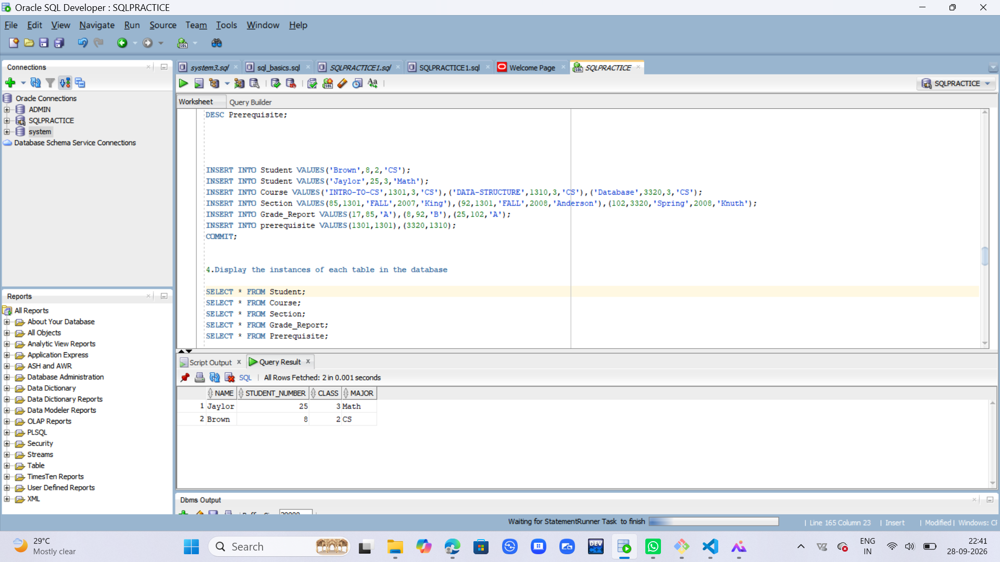
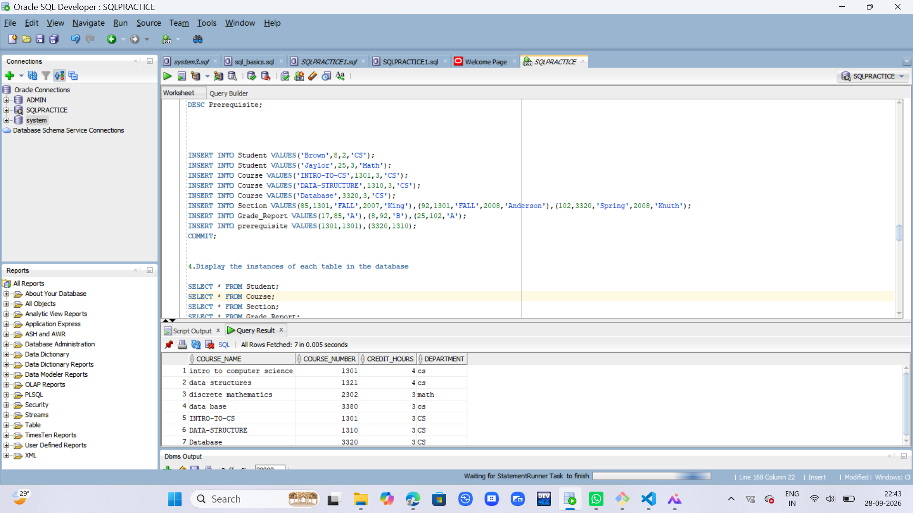
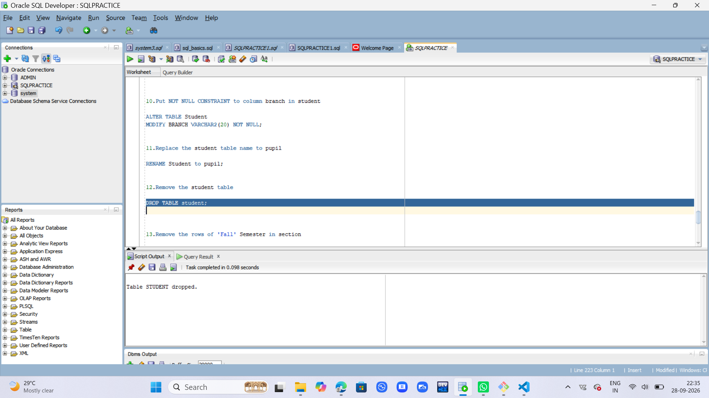

## 1.create the tables 
```
CREATE TABLE Student(
Name VARCHAR2(30),
Student_number NUMBER PRIMARY KEY,
Class NUMBER,
Major VARCHAR2(50) );


CREATE TABLE Course (
Course_Name VARCHAR2(20),
Course_Number NUMBER PRIMARY KEY,
Credit_Hours NUMBER,
Department VARCHAR2(30) );


CREATE TABLE Section(
Section_Identifier NUMBER PRIMARY KEY,
Course_Number NUMBER,
Semester VARCHAR2(20),
Year NUMBER,
Instructor VARCHAR2(40),
FOREIGN KEY(Course_Number) REFERENCES Course(course_Number) );


CREATE TABLE Grade_Report(
Student_Number NUMBER,
Section_Identifier NUMBER,
Grade CHAR(2),
PRIMARY KEY(Student_Number,Section_Identifier),
FOREIGN KEY(Student_Number) REFERENCES Student(Student_Number),
FOREIGN KEY(Section_Identifier) REFERENCES Section(Section_Identifier) );
DESC grade_report;


CREATE TABLE Prerequisite(
Course_Number NUMBER,
Prerequisite_Number NUMBER,
PRIMARY KEY(Course_Number),
FOREIGN KEY(Course_Number),
REFERENCES Course
(Course_Number)
);
```

## 2.Display the decription of each table
```
DESC Student;
```

```
DESC Grade_Report;
```

```
DESC Prerequisite;
```
```
DESC section;
```


```
DESC course;
```


##3.insert the values
```
INSERT INTO Student VALUES('Brown',8,2,'CS');
INSERT INTO Student VALUES('Jaylor',25,3,'Math');
INSERT INTO Course VALUES('Database',3320,3,'CS');
INSERT INTO Section VALUES(85,1301,'FALL',2007,'King');
INSERT INTO Section VALUES(102,3320,'Spring',2008,'Knuth');
INSERT INTO Grade_Report VALUES(17,85,'A');
INSERT INTO Grade_Report VALUES(25,102,'A');
INSERT INTO prerequisite VALUES(1301,1301);
INSERT INTO prerequisite VALUES(3320,1310);
```

##4.Display the instances of each table in the database
```
SELECT*FROM THE STUDENT;
```

```
SELECT * FROM Course;
```

```
SELECT * FROM Grade_Report;
```


##5.All branch attribute in student table and Describe the table
```
ADD Branch VARCHAR2(20);
DESC Student;
```

##6.Copy Major attribure values into branch attribute and display it
```
UPDATE Student
SET Branch = Major;
SELECT * FROM Student;
```
##7.REMOVE THE MAJOR ATTTRIBUTE IN STUDENT
```
ALTER TABLE Student
DROP COLUMN Major;
```
##8.Change the name of Course_number to cid in course and describe it
```
RENAME COLUMN Course_Number TO CID;
DESC Course;
```

##9.change the value of credit-hrs of database to 4 in course
```
UPDATE Course
SET Credit_Hrs = 4;
SELECT * FROM Course;
```

##10.put not null constraints to column branch in student
```

ALTER TABLE Student
MODIFY BRANCH VARCHAR2(20) NOT NULL;
```

##11.Replace the student table name to pupil
```
RENAME Student to pupil;
```

##12.Remove the student table
```
DROP TABLE student;
```


##13.Remove the rows of 'Fall' Semester in section
```
DELETE FROM Section
WHERE Semester = 'Fall';
COMMIT;
```
##14.remove the rows of data structres in course
```
DELETE FROM Course
WHERE Course_Name = 'Data_Structure';
COMMIT;
```
##15.remove all rows in all tables using truncate table
```
TRUNCATE TABLE Grade_Report;
TRUNCATE TABLE Prerequisite;
TRUNCATE TABLE Section;
TRUNCATE TABLE Course;
TRUNCATE TABLE Pupil;
```
##16.remove pupils,course and section table so that it exist in recycle bin
```
DROP TABLE Pupil;
DROP TABLE Course;
DROP TABLE Section;
```
##17. remove grade_report table permanently
```
DROP TABLE Grade_Report PURGE;
DROP TABLE Prerequisite PURGE;
```

