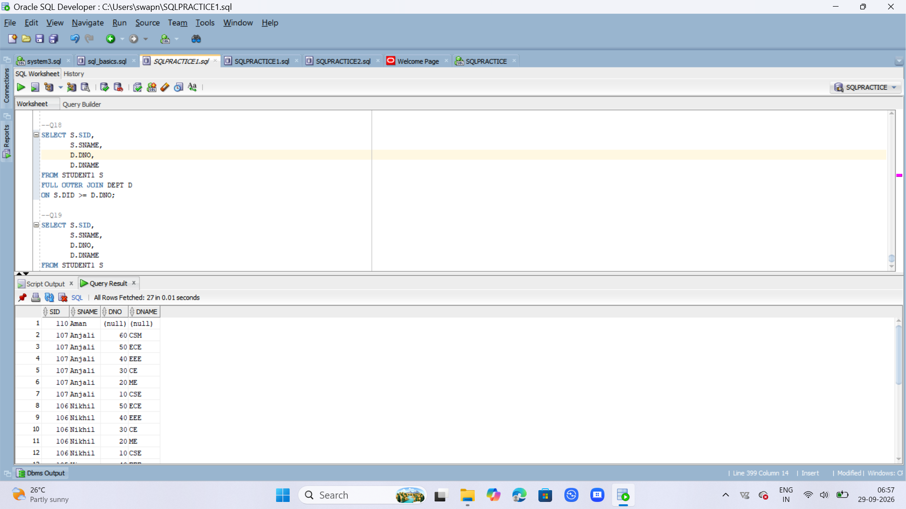

##queries

--q1
```
CREATE TABLE DEPT
(
    DNO NUMBER PRIMARY KEY,
    DNAME VARCHAR2(30) NOT NULL
);
```
--q2
```
CREATE TABLE STUDENT1
(
    SID NUMBER PRIMARY KEY,
    SNAME VARCHAR2(30) NOT NULL,
    DID NUMBER
    );
 ```
```
DESC DEPT;
DESC STUDENE1;
```

 
--Q3
```
ALTER TABLE STUDENT1
ADD CONSTRAINT FK_DID
FOREIGN KEY(DID)
REFERENCES DEPT(DNO);
```
q5
```
INSERT INTO DEPT VALUES (40, 'EEE');
INSERT INTO DEPT VALUES (60, 'CSM');
INSERT INTO DEPT VALUES (70, 'CSD');
COMMIT;
```
--Q6
```
INSERT INTO STUDENT1 VALUES (101, 'Rahul', 10);
INSERT INTO STUDENT1 VALUES (102, 'Sneha', 20);
INSERT INTO STUDENT1 VALUES (104, 'Priya', 30);
INSERT INTO STUDENT1 VALUES (105, 'Kiran', 40);
INSERT INTO STUDENT1 VALUES (106, 'Nikhil', 50);
INSERT INTO STUDENT1 VALUES (107, 'Anjali', 60);
INSERT INTO STUDENT1 VALUES (108, 'Ravi', 10);
INSERT INTO STUDENT1 VALUES (109, 'Pooja', 20);
INSERT INTO STUDENT1 VALUES (110, 'Aman', NULL);

COMMIT;
```


--Q7
```
SETECT SID,SNAME,DNO,DNAME
FROM STUDENT1 S
JOIN DEPT D
ON S.DID=D.DNO;
```

SELECT * FROM STUDENT1;
SELECT * FROM DEPT;


--Q8
```
SELECT S.SID,
       D.DNO,
       D.DNAME
FROM STUDENT1 S
INNER JOIN DEPT D
ON S.DID = D.DNO;
```
--Q9
```
SELECT S.SID,
       S.SNAME,
       D.DNO,
       D.DNAME
FROM STUDENT1 S
JOIN DEPT D
ON S.DID > D.DNO;
```

--Q10
```
SELECT S.SID,
       S.SNAME,
       S.DID,
       D.DNAME
FROM STUDENT1 S
LEFT OUTER JOIN DEPT D
ON S.DID = D.DNO;
```

--Q11
```
SELECT S.SID,
       D.DNO,
       D.DNAME
FROM STUDENT1 S
RIGHT OUTER JOIN DEPT D
ON S.DID = D.DNO;
```

--Q12
```
SELECT S.SID,
       S.SNAME,
       D.DNO,
       D.DNAME
FROM STUDENT1 S
FULL OUTER JOIN DEPT D
ON S.DID = D.DNO;
```
--Q13
```
SELECT S.SID,
       S.SNAME,
       D.DNAME
FROM STUDENT1 S
LEFT OUTER JOIN DEPT D
ON S.DID = D.DNO;
```

--Q14
```
SELECT S.SID,
       D.DNAME
FROM STUDENT1 S
RIGHT OUTER JOIN DEPT D
ON S.DID = D.DNO;
```
--Q15
```
SELECT S.SID,
       S.SNAME,
       D.DNAME
FROM STUDENT1 S
FULL OUTER JOIN DEPT D
ON S.DID = D.DNO;
```
--Q16
```
SELECT S.SID,
       S.SNAME,
       D.DNO,
       D.DNAME
FROM STUDENT1 S
LEFT OUTER JOIN DEPT D
ON S.DID >= D.DNO;
```
--Q17
```
SELECT S.SID,
       S.SNAME,
       D.DNO,
       D.DNAME
FROM STUDENT1 S
RIGHT OUTER JOIN DEPT D
ON S.DID >= D.DNO;
```
--Q18
```
SELECT S.SID,
       S.SNAME,
       D.DNO,
       D.DNAME
FROM STUDENT1 S
FULL OUTER JOIN DEPT D
ON S.DID >= D.DNO;
```

--Q19
```
SELECT S.SID,
       S.SNAME,
       D.DNO,
       D.DNAME
FROM STUDENT1 S
CROSS JOIN DEPT D;
```
 
